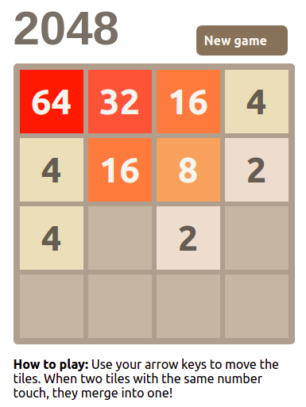

<h1 align="center">2048 - Game</h1>

> Application is available at [https://game-jn-2048.web.app/](https://game-jn-2048.web.app/)

The famous application 2048 game available as an app for [Android](https://play.google.com/store/apps/details?id=com.androbaby.game2048) and [iOS](https://apps.apple.com/br/app/2048/id840919914)

  

## Tecnologies

## Project status

## Project origins

>This project was born from author's need of learning fundamentals os front-end development. 

## Runnig locally
1. Download repository with: `git clone https://github.com/JFRNogueira/2048-game.git`
2. Navigate to project folder: `cd 2048-game`
3. Install dependencies with `npm install`
4. Start project `npm start`

## Deploy application
1. Download repository with: `git clone https://github.com/JFRNogueira/2048-game.git`
2. Navigate to project folder: `cd 2048-game`
3. Install dependencies with `npm install`
4. Start project `npm start`

## Next steps
1. Fix score counter
2. Request username
3. Record results on a database
4. Create users' rank

## Developers

<table>
  <tr>
    <td align="center">
       <b>Johannes Nogueira</b></a> 
      
    </td>
  </tr>
</table>

